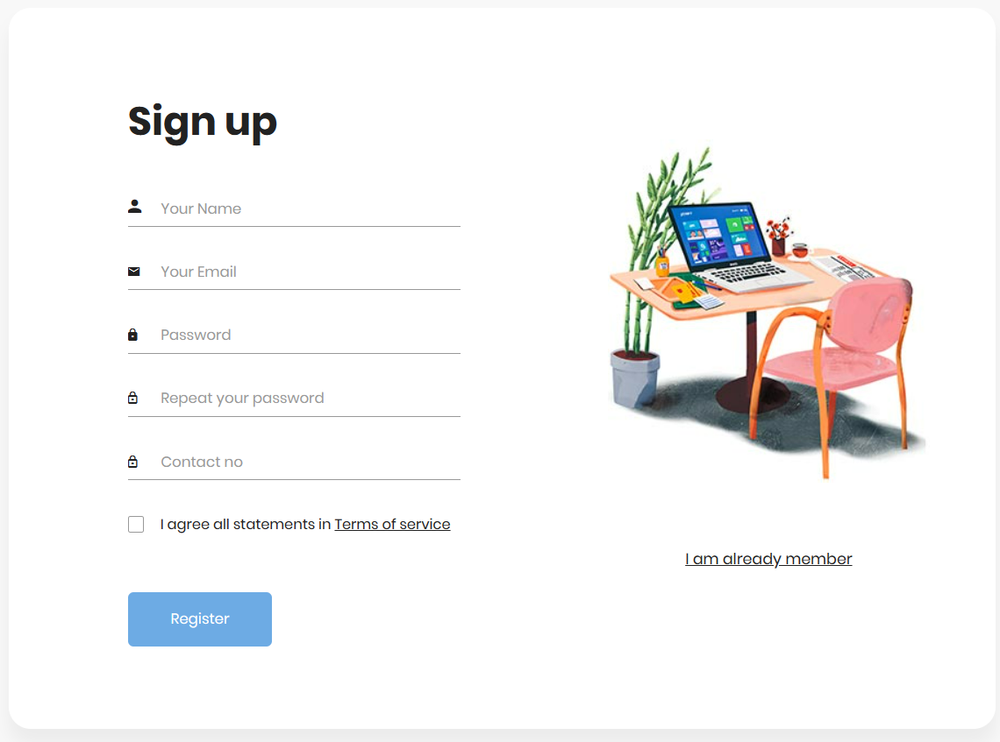
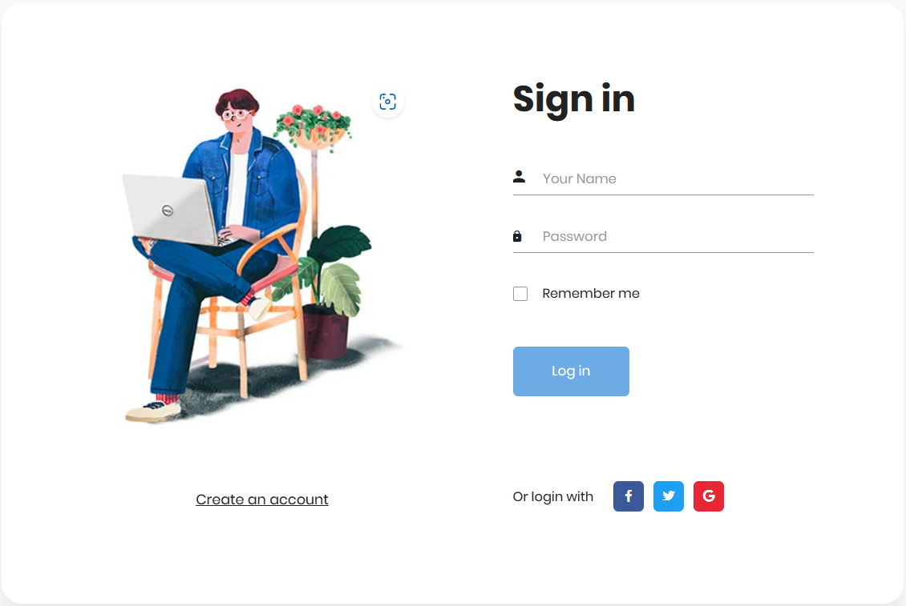
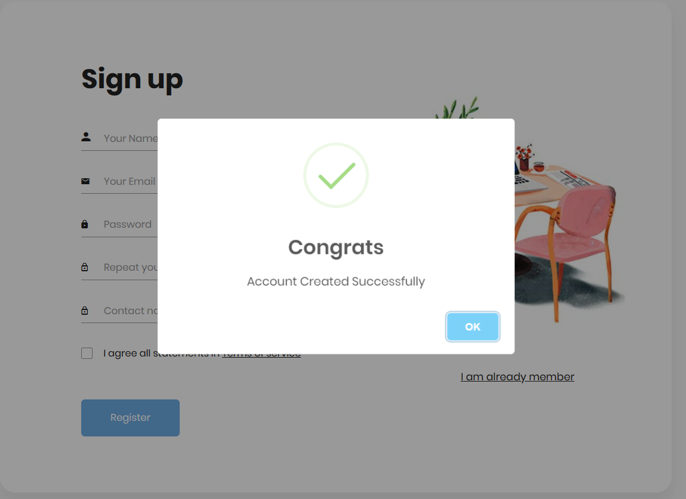
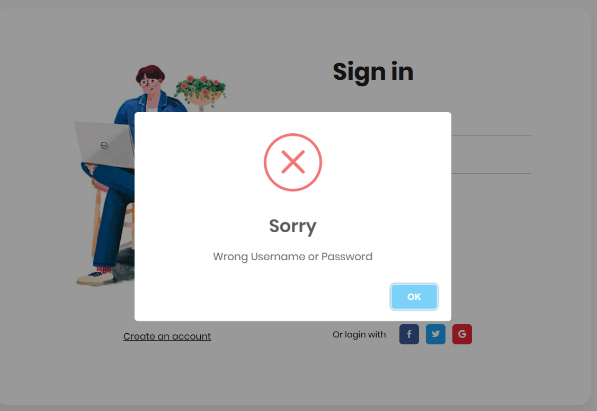
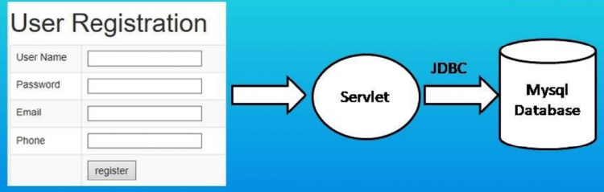

# Login_registration_using_jsp_servlet_JDBC_MYSQL


# project-documentation

<p align="">
  <a href="" rel="noopener">
 </a>
 </a>
</p>


<h3 align="center">Login_registration_using_jsp_servlet_JDBC_MYSQL</h3>

<div align="center">

  []() 
  [](https://github.com/kylelobo/The-Documentation-Compendium/issues)
  [](https://github.com/kylelobo/The-Documentation-Compendium/pulls)
  [](/LICENSE)

</div>

---

<p align="center"> 
User login & Registration setup using JSP, Servlet, JDBC in eclipse and Tomcat
Server. 
I will create a user Registration form & Login using JSP. On submitting the form
control goes to a servlet. 
The servlet calls the class function, that further communicates with 
the MYSQL database using JDBC. And the user registration data is inserted into the 
database.
<br>
  
</p>

## 📝 Table of Contents
- [About](#about)
- [Getting Started](#getting_started)
- [Deployment](#deployment)
- [Usage](#usage)
- [Flow Chart](#flowchart)
- [TODO](../TODO.md)
- [Authors](#authors)
- [Acknowledgments](#acknowledgement)

## 🧐 About <a name = "about"></a>
### 🔏 Registration-form 
- In Registration form, we will have a form to fill all the details which will contain 
name, username, password, address, contact number, etc.
This form will help us to register with the application. They take all our details and 
store it in a database.

### ✍ which has the following fields:
1. Name
2. E mail
3. Password
4. Repeat Password
5. Contact Number

   - After filling all these details we have Register button, on click of that button all the details
will be stored In MYSQL Database.
### 🔐 Login and logout form
- Like registration form we will have a login and logout form. In this example, we have 
taken Login form where we have two fields “username” and “password” with a submit 
button.

-  When we click on submit button then we get welcome message with a logout button.

-  When we click on logout button then we get back to login form

- To perform login and registration with JSP and MySQL with practices that will show 
you, how to create java application and connect it with MSQL a database. or an idea for java 
database connectivity (JDBC) with MySQL

## 🏁 Getting Started <a name = "getting_started"></a>
### Eclipse setup:
```
Step:1 
     Create a new project → select dynamic web projects→ project Name 
Step:2 
     Create database table 
Step:3
     Server setup Apache tomcat 9.0 download and add the server in eclipse 
Step:4
     MY SQL Connector jar 8.0 download and added
Step:5
     start your project

``` 

## 📜 Prerequisites

### ⚓ software required 

1. ECLIPSE IDE - EE Version
2. MYSQL Workbench 
3. JDK 
4. APACHE TOMCAT 9.0 Server

### 🔧 Technologies Are Being Used:
```
✓ JDK
✓ ECLIPSE
✓ APACHE TOMCAT 9.0
✓ MYSQL
✓ SERVLET
✓ JSP
✓ JDBC

```

### ⚒ Installing

- [Eclispe IDE](https://www.eclipse.org/downloads/) - JDK 
- [MYSQL Workbench](https://dev.mysql.com/downloads/workbench/) - Database
- [Apache tomcat 9.0](https://tomcat.apache.org/download-90.cgi) - Apache tomcat 9.0
- [MYSQL Connecter Jar](https://dev.mysql.com/downloads/connector/j/) -MYSQL Connecter Jar 


```
1. Downloading the whole file from Github repository
2. Extract file 
3. File would be open with Eclipse IDE
4. Server file add to the Eclispe IDE
5. MYSQL Connect jar file added 
6. Run on server

```
## CREATE A JSP FILE

```

✓ Go to Webapp in project file → right click → new → JSP file → File Name → finish
✓ Then design your webpage 
✓ Same procedure as registration & login page

```
## CREATE A SERVLET PAGE
```
✓ Java Resources → create a package →new → servlet → servlet name → finish
```


## 🔧 Running the tests <a name = "tests"></a>
### VALIDATION IMAGE 

 </a>
 </a>
### Break down into end to end tests
Explain what these tests test and why

```
Give an example
```

## 🎈 Usage <a name="usage"></a>
```
1. Login Page is used to allow the user's to login on the website and application.
 
2. Applications/Websites identifies the users with their username and password.
 
3. Login Page takes user input and passes the data to server-side program. The authentication is done by server-side program and authentication results (message) is displayed to user on the website site login form. If user is authenticated they are forwarded to the secure section of the website.
 
4. Login form also provides the link for the registration page. If website user is already not registered then he/she can register by visiting the registration section of the website.
```

## 🚀 Deployment <a name = "deployment"></a>
```
1. Downloading the whole file from Github repository
2. Extract file 
3. File would be open with Eclipse IDE
4. Server file add to the Eclispe IDE
5. MYSQL Connect jar file added 
6. Run on server

```

## ⛏️ Flow Chart <a name = "flowchart"></a>




## ✍️ Authors <a name = "authors"></a>
- [Poontamilzhan K](https://github.com/POONTAMILZHAN) - FSD


## 🎉 Acknowledgements <a name = "acknowledgement"></a>
- Inspiration
- Create a secure website 
  
- References

 ## links References 🔗
 - [🔗 link 1 ](https://www.codewithmurad.com/2020/10/registration-login-form.html) -Website 
 - [🔗 link 2 ](https://www.bing.com/videos/search?q=reference+for+login+and+registration+using+jsp+servlets&docid=603486619291432072&mid=D63A4BCC29603D33137CD63A4BCC29603D33137C&view=detail&FORM=VIRE) -Youtube 
